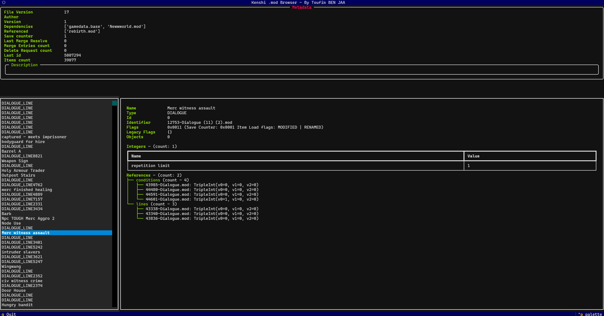
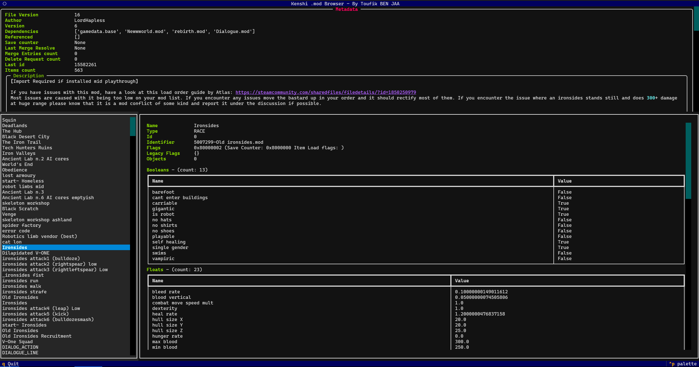
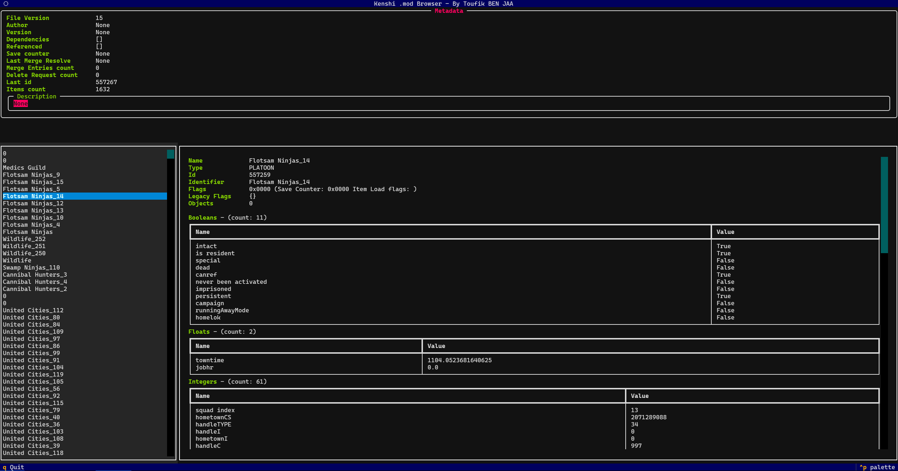

# kenshi-mod-tools

A Python CLI to inspect and manipulate Kenshi game data files (`.mod`, `.save`, `.zone`, `.level`).

Built by **Toufik BEN JAA** from reverse-engineering the binary format, it lets you browse file
contents interactively, extract translatable strings into a standard `.po` file, and import
translations back into the original mod.

## Features

- **Interactive browser** — navigate items, fields, and references in a terminal UI
- **PO export** — extract all translatable strings (names, descriptions, dialogue) into a `.po`
  file ready for any translation tool
- **PO import** — apply a translated `.po` back to the original mod, producing a new file that
  can be loaded by the game

Supports file versions 8 through 17. `.save` files can be read but not written yet.

## Screenshots


  

  


## Requirements

Python 3.10+ is required.

```
pip install -r src/kenshi_extractor/requirements.txt
```

## Usage

### View a file interactively

```
python cli.py view "path/to/file.mod"
```

Browse items with the list on the left. Select one to inspect its fields, references, and
placement objects on the right. Press `q` to quit.

### Export translatable strings to PO

```
python cli.py po-export "path/to/file.mod" output.po
```

Produces a `.po` file containing all translatable fields. Each entry is keyed by item
identifier, type, and field name so that imports can map back precisely.

### Import a translated PO into a mod

```
python cli.py po-import "path/to/file.mod" translated.po "path/to/output.mod"
```

Reads the translated entries from `translated.po` and writes a new file with the translated
strings in place. The original file is not modified.

## Disclaimer

This tool is the result of reverse engineering and may contain mistakes.
It is intended for interoperability, modding, documentation, and translation purposes.
